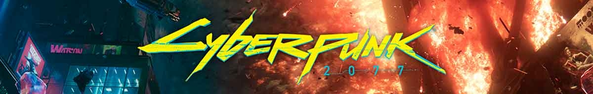
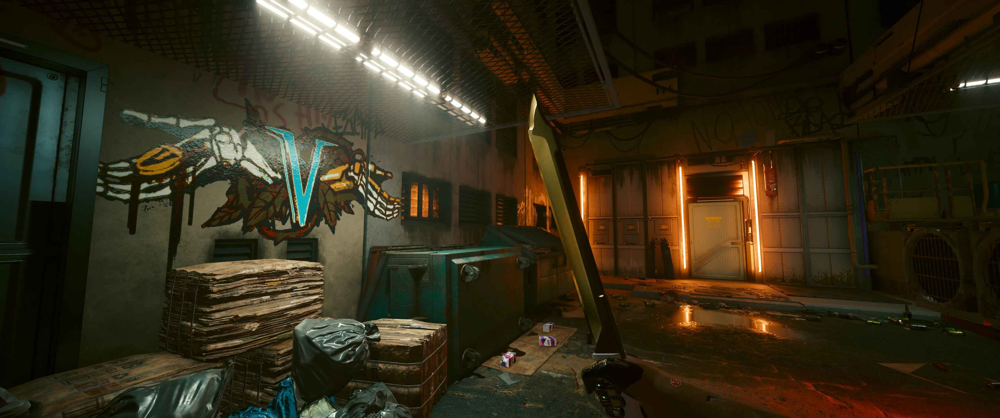
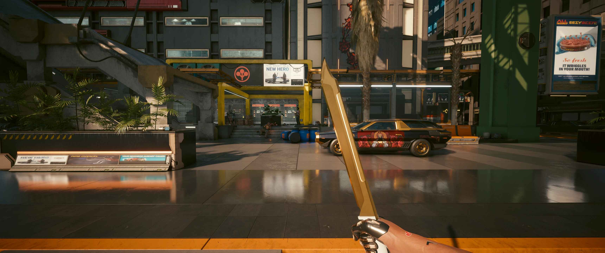
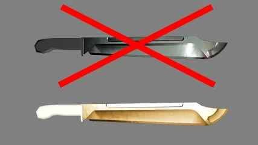
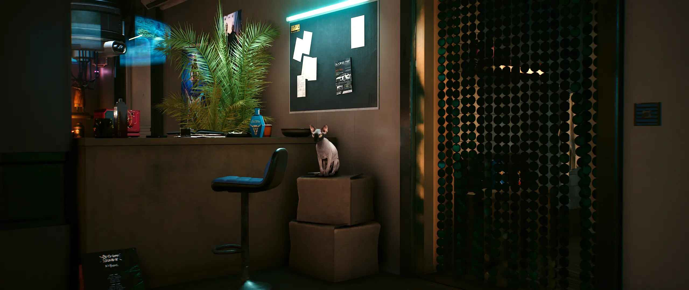
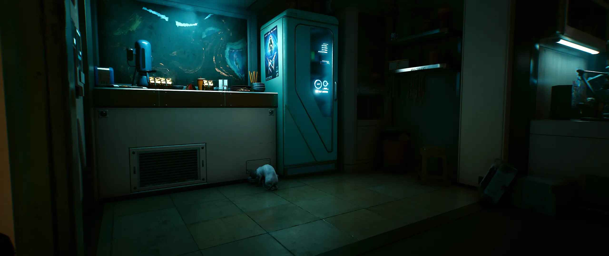
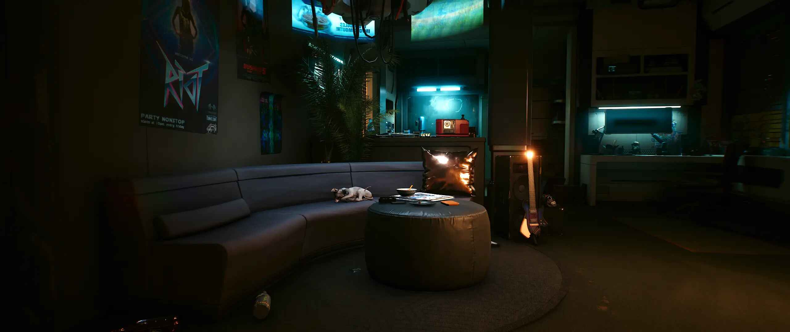
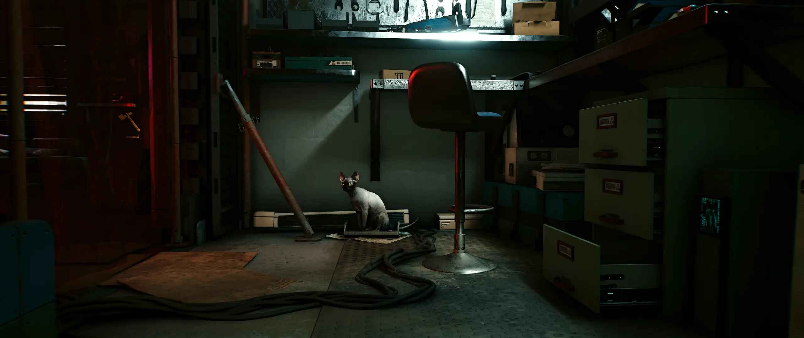
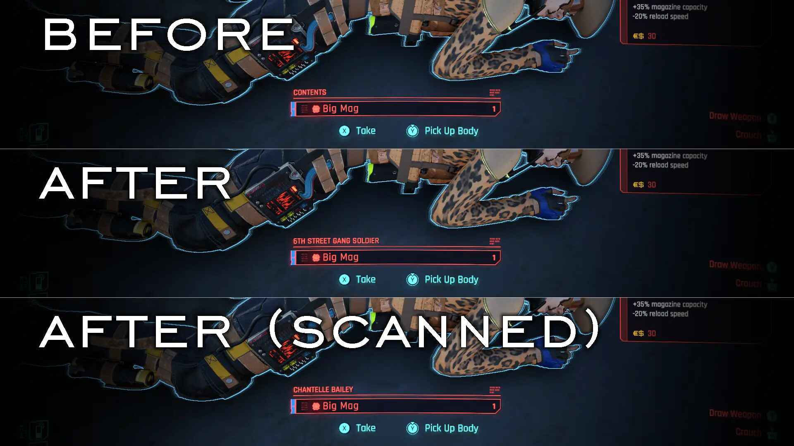

# cyberpunk_2077

My modlist for Cyberpunk 2077. I do not claim any copyright or ownership or involvement with any of these images, mods, or assets.

# Warnings / Remembers

| Problem | Solution |
|----------|----------|

# Essential (many mods need these)

| Number | Mod | Brief summary | Spanish translation | Video review |
|----------|----------|----------|----------|----------|
| 1 | [ArchiveXL](https://www.nexusmods.com/cyberpunk2077/mods/4198) | Archive extension loader. | Not needed. | Not needed. |
| 2 | [Cyber Engine Tweaks](https://www.nexusmods.com/cyberpunk2077/mods/107) | Scripting framework for modders and quality of life fixes. | Not needed. | Not needed. |
| 3 | [Native Settings UI](https://www.nexusmods.com/cyberpunk2077/mods/3518) | This mod allows other mods to easily add settings menus using only native UI, thus looking like the games settings menu. | Not needed. | Not needed. |

# Fix / fixes

| Number | Mod | Brief summary | Spanish translation | Video review |
|----------|----------|----------|----------|----------|
| 1 | [No Intro Videos](https://www.nexusmods.com/cyberpunk2077/mods/533) | Disables the game intro videos. | Not needed. | Not needed. |
| 2 | [Faster Elevators](https://www.nexusmods.com/cyberpunk2077/mods/18389) | Allows you to adjust the speed of elevators. | 
| 3 | [Horizon Sandstorm Flickering Fix](https://www.nexusmods.com/cyberpunk2077/mods/19142) | Mod fixes the flickering of the horizon sandstorm effect used in quest moments like "Riders on the Storm". | Not needed. | :tv: todo |
| 4 | [Slow Firing Rate on Longer Saves Bug Fix](https://www.nexusmods.com/cyberpunk2077/mods/18768) | There is a bug in the game which causes the firing rate of auto and burst weapons to slow down as your total play time (since beginning the character) increases. This bug affects all playthroughs and (auto) weapons. This mod mostly fixes it, as much as is possible. | Not needed. | :tv: [Slow Firing Rate on Longer Saves Bug Fix](https://www.youtube.com/watch?v=HHU3gX2LhOY) |
| 5 | [Effects Rendering Fix](https://www.nexusmods.com/cyberpunk2077/mods/19258) | A workaround for 2.0 bug related to effects rendering that would cause ugly-looking particles with constant motion blur/aliasing. | Not needed. | :tv: [Effects Rendering Fix](https://www.youtube.com/watch?v=7V2y5NqSgeU) |

# Locations

| Number | Mod | Brief summary | Spanish translation | Video review |
|----------|----------|----------|----------|----------|

# Perks / Level up menu/screen

| Number | Mod | Brief summary | Spanish translation | Video review |
|----------|----------|----------|----------|----------|

# Immersion

| Number | Mod | Brief summary | Spanish translation | Video review |
|----------|----------|----------|----------|----------|
| 1 | [Windows 77](https://www.nexusmods.com/cyberpunk2077/mods/19306) | Upgrade Your PC To The Latest Version Of Windows. Windows 77! | Not needed. | :tv: todo |

Gold Machetes for Valentinos
 

# Meshes

| Number | Mod | Brief summary | Spanish translation | Video review |
|----------|----------|----------|----------|----------|
| 1 | [HQ Burger](https://www.nexusmods.com/cyberpunk2077/mods/18970) | This mod only replaces 2 instances of the low quality burger models with CGI grade 3d models made by scanning real world burgers. | Not needed. | :tv: todo |

HQ Burger
 Before: 

# Weapons

| Number | Mod | Brief summary | Spanish translation | Video review |
|----------|----------|----------|----------|----------|
| 1 | [Gold Machetes for Valentinos](https://www.nexusmods.com/cyberpunk2077/mods/19377) | Valentinos have a unique machete so why isn't it GOLD? | todo | :tv: todo |

Gold Machetes for Valentinos
 

# DLC sized expansions

| Number | Mod | Brief summary | Spanish translation | Video review |
|----------|----------|----------|----------|----------|

# Animations

| Mod | Brief summary | Spanish translation |
|----------|----------|----------|

# Buildings

| Mod | Brief summary | Spanish translation |
|----------|----------|----------|

# Radio

| Mod | Brief summary | Spanish translation |
|----------|----------|----------|

# Crowd / population / people

| Number | Mod | Brief summary | Spanish translation | Video review |
|----------|----------|----------|----------|----------|
| 1 | [Alternate Population](https://www.nexusmods.com/cyberpunk2077/mods/15499) | Alters the population of Night City by changing how NPC act and react in the world for an alternate Night City experience. Faster traffic, more dynamic combat, better reactions + more. | todo | :tv: todo |

# Creatures / Monsters / Enemies

| Mod | Brief summary | Spanish translation |
|----------|----------|----------|
| [Fog Crawlers Of The Commonwealth.](https://www.nexusmods.com/fallout4/mods/55698) | todo | todo |
| [Institute Centaurs.](https://www.nexusmods.com/fallout4/mods/41476) | todo screenshot | todo |
| [Respawnable Legendary Bosses and Hard Legendary Giant Creatures](https://www.nexusmods.com/fallout4/mods/10124) | todo | todo |
| [Mirelurk Queen Variants.](https://www.nexusmods.com/fallout4/mods/13333) | todo | todo |
| [Super Mutant Redux.](https://www.nexusmods.com/fallout4/mods/11853) | 'Reworks the super mutant faction including Behemoths, FEV Hounds, and of course, Super Mutants.' | [Super Mutant Redux_Spanish.](https://www.nexusmods.com/fallout4/mods/50713) |

PUT SCREENSHOTS

# Settlements

| Mod | Brief summary | Spanish translation |
|----------|----------|----------|
| [Settlement Menu Manager.](https://www.nexusmods.com/fallout4/mods/24204) | todo | todo |
| [Dino's Decorations - clutter arrangements for your settlements.](https://www.nexusmods.com/fallout4/mods/16186) | Make your settlements look a little more lived in, requires: [Place Everywhere](https://www.nexusmods.com/fallout4/mods/9424) | todo |
| [Snappable Clutter and Display.](https://www.nexusmods.com/fallout4/mods/69980) | Adds modular clutter that will snap to provided furniture, giving you limitless combinations to add clutter to your settlements. | todo |
| [Sandbag Fortifications.](https://www.nexusmods.com/fallout4/mods/21358) | todo | todo |
| [Settlement Keywords Expanded.](https://www.nexusmods.com/fallout4/mods/12226) | Needed by some mods. | todo |
| [Objects for Bathroom and Kitchen - WorkshopPack.](https://www.nexusmods.com/fallout4/mods/38515) | Adds washing machine & dryer + some more objects for your bathroom. | todo |
| [Minutemen Propaganda Posters.](https://www.nexusmods.com/fallout4/mods/11975) | todo | todo |
| [Nothing Fancy Hot Showers.](https://www.nexusmods.com/fallout4/mods/46241) | Adds 4 showers and some color variants, showers work like a decontamination arch. Requires DLC: Wasteland Workshop. | todo |
| [Showers ESL.](https://www.nexusmods.com/fallout4/mods/36107) | ix showers that boost your charisma or remove your rads. | todo |

# Nuka World

| Mod | Brief summary | Spanish translation |
|----------|----------|----------|
| [Nukatown Market - Reborn.](https://www.nexusmods.com/fallout4/mods/24057) | A new expansion of the Nukatown market from the Nukaworld DLC. | todo |
| [No Quest Autostart - Nuka World.](https://www.nexusmods.com/fallout4/mods/31433) | Prevents the Nuka-World main quest from running without either visiting the Nuka-World Transit Station or listening to the radio station. | Not needed. |

# Quests

| Number | Mod | Brief summary | Spanish translation | Video review |
|----------|----------|----------|----------|----------|
 

# Dungeons, underground spaces and vaults

| Number | Mod | Brief summary | Spanish translation | Video review |
|----------|----------|----------|----------|----------|

# Armor / Armors / Cloth / Clothes / Clothing

| Number | Mod | Brief summary | Spanish translation | Video review |
|----------|----------|----------|----------|----------|

# Cut content

| Number | Mod | Brief summary | Spanish translation | Video review |
|----------|----------|----------|----------|----------|

# Textures

| Number | Mod | Brief Summary | Spanish Translation | Video review |
|----------|----------|----------|----------|----------|

# Base Object Swapper

# Gameplay

| Number | Mod | Brief Summary | Spanish Translation | Video review |
|----------|----------|----------|----------|----------|

# NPC's

| Number | Mod | Brief summary | Spanish translation | Video review |
|----------|----------|----------|----------|----------|
| 1 | [Better Children](https://www.nexusmods.com/cyberpunk2077/mods/16462) | Better faces for children: make Night City's minors more childlike and less creepy. No dependencies required! | Not needed. | :tv: todo |
   
# Companions / New companions

| Number | Mod | Brief Summary | Spanish Translation | Video review |
|----------|----------|----------|----------|----------|

# Weather

| Number | Mod | Brief Summary | Spanish Translation | Video review |
|----------|----------|----------|----------|----------|

# Collectibles

| Number | Mod | Brief Summary | Spanish Translation | Video review |
|----------|----------|----------|----------|----------|
| 1 | [4x Magazine Framework](https://www.nexusmods.com/cyberpunk2077/mods/16256) | Massively expand magazines in Night City! This framework does 2 things: First, it expands the number of magazines by 4x the amount in the base game. Second, it randomizes the magazines in Night City. Installing this by itself only does the second, so it is recommended to also install a mod made for this framework to utilize graphic expansion part. | todo | :tv: todo |
    
# Quality of life mods

| Number | Mod | Brief Summary | Spanish Translation | Video review |
|----------|----------|----------|----------|----------|

# Lighting

| Number | Mod | Brief Summary | Spanish Translation | Video review |
|----------|----------|----------|----------|----------|

# Landscape modifications / Map structures

| Number | Mod | Brief Summary | Spanish Translation | Video review |
|----------|----------|----------|----------|----------|

# Interiors

| Number | Mod | Brief Summary | Spanish Translation | Video review |
|----------|----------|----------|----------|----------|

# Homes / Houses

| Number | Mod | Brief Summary | Spanish Translation | Video review |
|----------|----------|----------|----------|----------|
| 1 | [Apartment Cats - Corpo Plaza](https://www.nexusmods.com/cyberpunk2077/mods/6329) | Adds a new (holographic) feline companion, Leia, to the Corpo Plaza apartment. Includes 11 different spots for her to use, as well as the option to pet her the same way as in the Pet The Cat mod. Includes 3 holographic appearances as well as a non-holo normal cat one. | Not needed. | :tv: todo |
| 2 | [Apartment Cats - Northside Motel](https://www.nexusmods.com/cyberpunk2077/mods/6379) | Adds a new feline companion, Jack, to the Northside motel apartment. Includes 9 different spots for him to use, as well as the option to pet him the same way as in the Pet The Cat mod. | Not needed. | :tv: todo |
| 3 | [Apartment Cats - Japantown](https://www.nexusmods.com/cyberpunk2077/mods/6493) | Adds a new feline companion, Elmo, to the Japantown apartment. Includes 12+ different spots for her to use, as well as the option to pet her the same way as in the Pet The Cat mod. | Not needed. | :tv: todo |
| 4 | [Apartment Cats - Dogtown](https://www.nexusmods.com/cyberpunk2077/mods/10325) | Adds a new feline companion, Suzi, to the Dogtown "apartment". Includes 12+ different spots for her to use, as well as the option to pet her the same way as in the Pet The Cat mod. | Not needed. | :tv: todo |
| 5 | [Apartment Cats - The Glen](https://www.nexusmods.com/cyberpunk2077/mods/6276) | Adds a new feline companion (Nali) to The Glen apartment. Includes 12 different spots for Nali to use, as well as the option to pet him the same way as in the Pet The Cat mod. | Not needed. | :tv: todo |

Apartment Cats
 Japantown:  Northside Motel: 

 # Magazines

| Number | Mod | Brief Summary | Spanish Translation | Video review |
|----------|----------|----------|----------|----------|

# Audio, music, SFX

| Number | Mod | Brief Summary | Spanish Translation | Video review |
|----------|----------|----------|----------|----------|

# Gore / blood / violence

| Number | Mod | Brief Summary | Spanish Translation | Video review |
|----------|----------|----------|----------|----------|
| 1 | [More Blood Splatters](https://www.nexusmods.com/cyberpunk2077/mods/3975) | The blood splatter/decal system in Cyberpunk is severely underutilized. This mod unleashes its potential with a customizable script-based implementation. | Not needed. | :tv: todo |
| 2 | [2077 More Gore V3.0](https://www.nexusmods.com/cyberpunk2077/mods/3040) | Adds more gore and detail to blood bursts and head shots. Updated more added, please see details. Game version 2.2 + Phantom Liberty and lower compatible. Blood now looks correct with path tracing enabled. | Not needed. | :tv: todo |

# Expansions

| Number | Mod | Brief Summary | Spanish Translation | Video review |
|----------|----------|----------|----------|----------|

# GUI / UI / User interface

| Number | Mod | Brief Summary | Spanish Translation | Video review |
|----------|----------|----------|----------|----------|
| 1 | [Better Loot Markers](https://www.nexusmods.com/cyberpunk2077/mods/3486) | (Updated to 2.2) Adds additional loot markers on looting containers that show which types of loot are in it. | Not needed. | :tv: todo |
| 2 | [Looting QoL](https://www.nexusmods.com/cyberpunk2077/mods/14730) | 

Looting QoL: 

# Map

| Number | Mod | Brief Summary | Spanish Translation | Video review |
|----------|----------|----------|----------|----------|

# Adults NSFW / adult content

| Number | Mod | Brief Summary | Spanish Translation |
|----------|----------|----------|----------|
